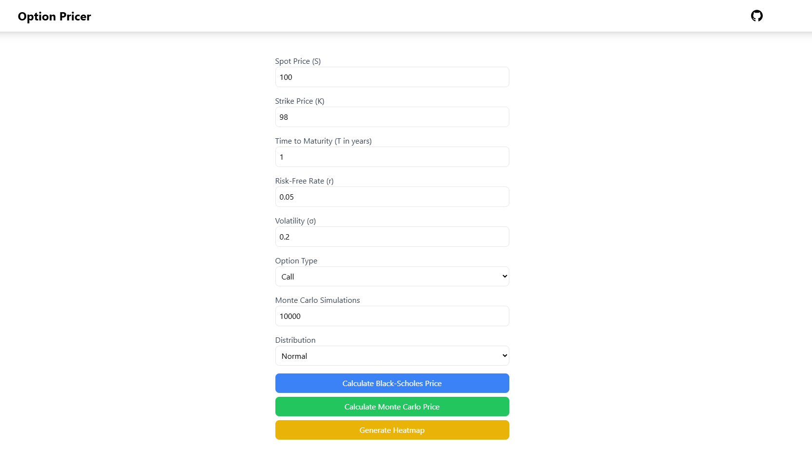

# Option Pricer

This is a full-stack web application for calculating option prices using both the Black-Scholes model and Monte Carlo simulation. The application also computes the Greeks (Delta, Gamma, Vega, Theta, Rho) and generates a heatmap for option price sensitivity.



## Features

- **Black-Scholes Price Calculation**: Compute the option price using the Black-Scholes model.
- **Monte Carlo Simulation**: Perform Monte Carlo simulations for option pricing.
- **Option Greeks**: Calculate the Greeks (Delta, Gamma, Vega, Theta, Rho) for better insights.
- **Heatmap Generation**: Visualize option price sensitivity based on stock prices and volatility using a heatmap.
- **Responsive Design**: The application uses Tailwind CSS for responsive design, ensuring a good user experience on all devices.

## Technologies Used

- **Frontend**:
  - React
  - TypeScript
  - Tailwind CSS
  - React Chart.js (for heatmap and chart rendering)
  - React Icons (for icons)
- **Backend (APIs)**:
  - Python (Flask/FastAPI or any backend to handle requests)
  - Pricing algorithms implemented in Python

## Getting Started

### Prerequisites

Make sure you have the following installed:

- Node.js (v14 or higher)
- npm or yarn
- Python (for backend pricing service)

### Installation

1. Clone the repository:

   ```bash
   git clone https://github.com/neuralsorcerer/option-pricer.git
   cd option-pricer
   ```

2. Install the frontend dependencies:

   ```bash
   cd frontend
   npm install
   # or
   yarn install
   ```

3. Start the frontend:

   ```bash
   npm run dev
   # or
   yarn run dev
   ```

4. For the backend, navigate to the backend directory and run the Python server:

   ```bash
   cd backend
   pip install -r requirements.txt
   python app.py
   ```

5. Visit `http://localhost:5173` to view the app.

## API Endpoints

The backend provides the following API endpoints:

- `POST /api/v1/black-scholes` - Calculate option price using Black-Scholes model.
- `POST /api/v1/monte-carlo` - Calculate option price using Monte Carlo simulation.
- `POST /api/v1/heatmap` - Generate heatmap data based on stock prices and volatility.

## Usage

1. Input the required data (Spot Price, Strike Price, Time to Maturity, Risk-Free Rate, Volatility, Option Type, etc.).
2. Click on the **Calculate Black-Scholes Price** button to calculate the option price and display the Greeks.
3. Click on the **Calculate Monte Carlo Price** button to perform a Monte Carlo simulation.
4. Click on **Generate Heatmap** to visualize option price sensitivity.

## License

This project is licensed under the [MIT License](LICENSE).
